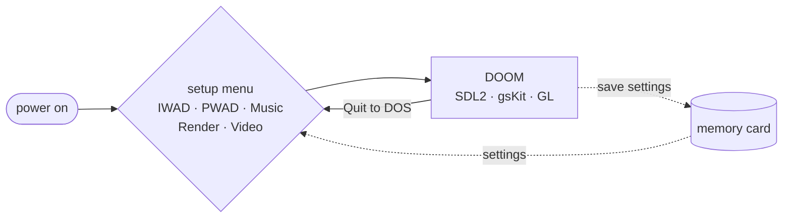
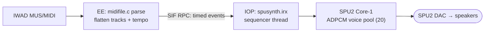

# DOOM — PlayStation 2 (ps2oom)

A native PlayStation 2 port of DOOM: full speed, hardware video, native SPU2
audio, dual-analog controller support, a controller-driven setup menu, **two
selectable music engines**, **three selectable video renderers**, and
limit-removing rendering so big PWADs (e.g. SIGIL) play.

Specialised for the PS2, built from
[doomgeneric](https://github.com/ozkl/doomgeneric) (and through it
[Chocolate Doom](https://github.com/chocolate-doom/chocolate-doom) and
id Software's original DOOM source).

## Features

- **Setup menu at boot** (controller-driven): pick **IWAD**, **PWAD**,
  **Music** engine, **Render** backend, and **Video** mode on one page.
  **✕ confirms, ○ cancels.**
- **Three video renderers**, switchable at runtime from the menu (each is its
  own ELF on the disc; choosing one hands off to it):
  - **SDL2** (software) — the default boot renderer.
  - **gsKit** (software) — Doom's 8-bit framebuffer uploaded as a PSMT8 texture
    + CLUT; the GS does the palette expand and bilinear upscale in hardware.
  - **GL** (experimental) — a hand-rolled VU1 + DMA hardware world renderer.
- **Six GS output modes** (gsKit renderer): NTSC 480i (default, composite-safe),
  NTSC 480p, PAL 576i, PAL 576p, 720p *(experimental)*, 1080i *(experimental)*.
- **Native audsrv audio** — sound effects mixed on the EE and streamed to the
  SPU2's PCM source (no SDL audio).
- **Two music engines**, switchable at runtime from the menu:
  - **OPL / FM (DBOPL)** — AdLib-style synthesis from the IWAD's GENMIDI lump,
    mixed into the audsrv stream. *Default.*
  - **SPU2 hardware-voice synth** — the MIDI is parsed/flattened on the EE,
    shipped to an IOP module over SIF RPC, and sequenced onto the SPU2's own
    hardware ADPCM voices. See below.
- **Limit-removing** — the vanilla static renderer limits (visplanes, drawsegs,
  vissprites, …) are raised, so detailed / large maps such as **SIGIL** play
  instead of erroring out. (Boom/MBF map features are still unsupported.)
- **Dual-analog controller** (libpad): modern layout, proportional analog turn,
  plus an **in-game Controller options page** (turn sensitivity, always-run,
  deadzone, invert look, swap sticks) — **saved to the memory card** (failsafe:
  no card → settings just stay for the session).
- **Flexible WAD loading** — IWAD + optional PWAD from a cdfs disc/ISO, from
  hostfs (PCSX2 `host:`), or the embedded shareware DOOM1.WAD; read on demand.
- **60 fps frame cap**; **quit-to-DOS returns to the setup menu** instead of the
  PS2 BIOS; fatal errors are shown on-screen rather than rebooting silently.
- **Fast boot** (~4 s to gameplay). The previous ~30 s stall was a
  libps2_drivers `waitUntilDeviceIsReady` device-probe timeout, now overridden.

## How it flows

The disc boots to a setup menu; the **Render** row hands off to the matching
renderer ELF, and **Quit to DOS** comes back to the menu (never the BIOS).
Controller settings round-trip through the memory card.



## Controls

Dual-analog, Xbox-style confirm (**✕** = the bottom face button):

| Input | Action |
|---|---|
| **Left stick** | move / strafe |
| **Right stick** | turn (proportional; sensitivity is adjustable) |
| **✕** | fire-use / **confirm** menus & prompts |
| **○** | **cancel** / open-close menu (Escape) |
| **□ / R2** | fire |
| **L2** | run (hold) |
| **L1 / R1** | previous / next weapon |
| **△ / Select** | automap |
| **Start** | menu |
| **D-pad** | menu navigation (also digital move/turn) |

Tune the sticks in-game under **Options → Controller** (turn sensitivity,
always-run, deadzone, invert look, swap sticks); changes persist to the memory
card on quit.

## The SPU2 hardware-voice synth (experimental)

Instead of software-rendering FM into the audio stream, this engine drives the
SPU2's **48 hardware ADPCM voices** as a sample-based MIDI synthesiser — the most
"native" way to make music on the PS2.



The EE parses the song (MUS→MIDI in memory), flattens every track in
absolute-tick order with tempo applied, and ships timed events to the IOP, where
a sequencer thread plays them onto a 20-voice pool using a synthesised
General-MIDI waveform bank (square/saw/triangle/sine/pulse + a noise sample for
drums) and a GM-family patch map. The result is the DOOM soundtrack on actual
SPU2 voices — a chiptune-ish rendering (synthesised waveforms, not recorded
instruments). It coexists with audsrv (which powers the chip up).

Both music engines are always built in; the **Music** row on the setup menu
picks one at runtime.

## Building

Everything builds in the official ps2dev toolchain through Docker (the ps2dock
image — see the root `Dockerfile`):

```sh
./build.sh                       # ps2/doomgeneric.elf (SDL2, no WAD baked in)
./build.sh EMBED_WAD=1           # + embed shareware DOOM1.WAD
./build.sh stable                # gsKit video, 480p default, embedded WAD
./build.sh gl                    # experimental GL hardware world renderer
./build.sh spumusic              # default the menu's Music row to the SPU2 synth
./build.sh iso                   # build ALL three renderer ELFs + pack every WAD
                                 #   in the WAD folder into a bootable PS2 ISO
./build.sh clean                 # remove build artifacts
./build.sh shell                 # interactive toolchain shell (cwd = ps2/)
```

Raw `make` flags also work (`./build.sh GSKIT_VIDEO=1 GS480P=1 EMBED_WAD=1`).
Note that the music engine, renderer, and video mode are now chosen **at runtime
on the setup menu** — the build flags (`SPU_MUSIC`, `GS480P`, the renderer
preset) only set the *defaults* a given ELF starts with.

The **`iso`** target is the full experience: it builds `DOOMSDL.ELF`,
`DOOMGS.ELF`, and `DOOMGL.ELF`, grafts them plus every WAD in the WAD folder
into `doom.iso` (boots `DOOMSDL.ELF`), and the menu's Render row hands off
between them. Run the ELF or ISO in PCSX2 or on real hardware. See
[`ps2/README.md`](ps2/README.md) for the technical design.

## WADs & copyright

No game data is committed to this repository (`*.wad` / `*.WAD` are git-ignored).
The shareware **DOOM1.WAD** (which id Software permits redistributing) may be
embedded for convenience; commercial IWADs (DOOM.WAD, DOOM2.WAD, …) are never
included — supply your own via hostfs or on an ISO. SIGIL needs the Ultimate
**DOOM.WAD** as its IWAD (episode 5) plus the `SIGIL_COMPAT.wad` PWAD.

## Credits & licence

Released under the **GPLv2** (see [`LICENSE`](LICENSE)). This port stands on:

- [doomgeneric](https://github.com/ozkl/doomgeneric) by ozkl
- [Chocolate Doom](https://github.com/chocolate-doom/chocolate-doom)
- id Software's original DOOM source
- the **DBOPL** OPL2/OPL3 emulator (from DOSBox)
- [ps2sdk](https://github.com/ps2dev/ps2sdk) and
  [gsKit](https://github.com/ps2dev/gsKit) (ps2dev)
