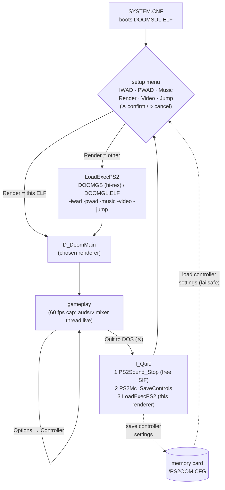
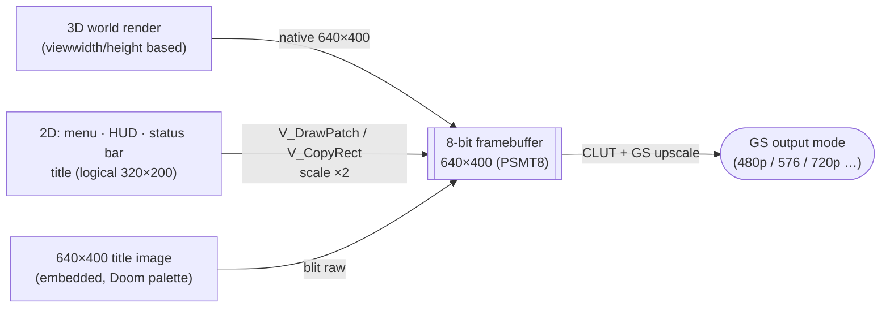
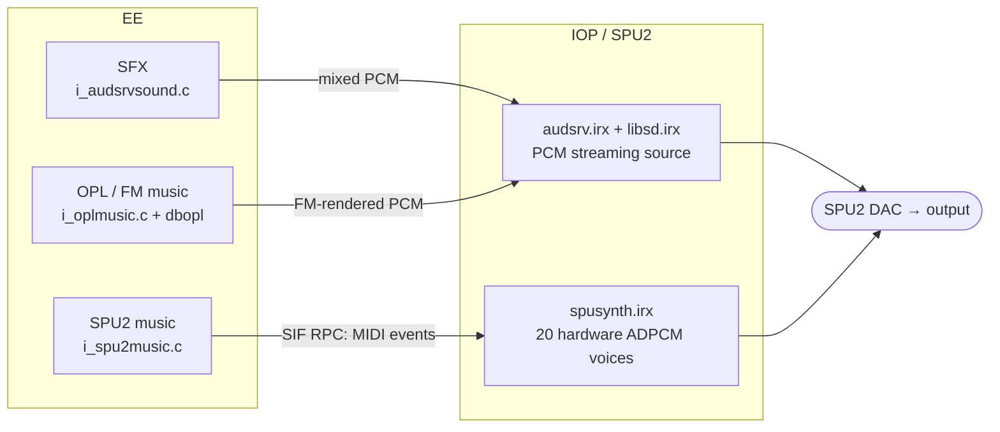

# doomgeneric — PlayStation 2 port (technical)

A PS2 port of [doomgeneric](https://github.com/ozkl/doomgeneric) built on the
[ps2dev](https://github.com/ps2dev/ps2dev) SDL2 toolchain. This document covers
the PS2-specific design; for an overview and build presets see the
[top-level README](../README.md).

## Design: thin upstream hooks

Almost all PS2 code lives here in `ps2/`. The upstream sources in
`../doomgeneric` are kept as close to stock as practical, but are no longer
strictly pristine — there are a small number of `#ifdef __PS2__` hooks plus the
limit-removing constant bumps:

- **Replaced** (compiled from `ps2/` instead of upstream): `doomgeneric_sdl.c`
  → `doomgeneric_ps2.c` (and the `_gs.c` / `_gl.cpp` renderer variants);
  `w_file.c` → `w_file_ps2.c`.
- **`#ifdef __PS2__` hooks** in upstream core: `d_main.c` (IWAD/PWAD selection,
  controller config bind, sound defaults, hi-res title image), `i_sound.c`
  (runtime music-engine pick), `i_system.c` (quit-to-launcher + on-screen
  `I_Error`, overridable `DEFAULT_RAM`/`MIN_RAM`), `g_game.c` (proportional
  analog turn, jump key), `p_user.c` (jump impulse), `m_menu.c` (in-game
  Controller options page), `m_config.c` (`ps2_*` controller vars), `i_timer.c`
  (`I_ResetBaseTime`).
- **Limit-removing** (raised vanilla constants — see below): `r_plane.c`,
  `r_defs.h`, `r_things.h`, `r_bsp.c`.
- **Hi-res** (`HIRES=1`, see [below](#hi-resolution-gskit-640400)): resolution
  decoupled from the 2D coordinate space — `i_video.h`, `v_video.c`, `r_plane.c`,
  `r_main.c`, `r_draw.c`, `st_stuff.h/.c`, `st_lib.c`.

## Setup menu, renderers, and launching

On boot, `ps2_iwad.c`'s `PS2_GetIWAD()` runs a one-page controller menu
(`ps2_menu.c` `PS2_SettingsMenu`, drawn on the libdebug GS text screen) with
six rows: **IWAD**, **PWAD**, **Music**, **Render**, **Video**, **Jump**. ✕
confirms, ○ cancels (the pad maps them; see `ps2_pad.c`). This runs *before*
audio starts, and on confirm waits for the button to release so the launch
press can't bleed into the game as a phantom keypress.

There are **three renderer ELFs** on the disc, one per video backend, all built
from the same tree with different flags:

| ELF | Backend | Build flag |
|---|---|---|
| `DOOMSDL.ELF` | SDL2 software, **320×200** (`doomgeneric_ps2.c`) | *(none — default boot)* |
| `DOOMGS.ELF` | gsKit PSMT8+CLUT, **640×400 hi-res** (`doomgeneric_ps2_gs.c`) | `GSKIT_VIDEO=1 HIRES=1` |
| `DOOMGL.ELF` | VU1+DMA hardware (`doomgeneric_ps2_gl.cpp` + `r_gl.c` + `r_native.c` + `draw_3D.vsm`) | `GL_VIDEO=1` |

`SYSTEM.CNF` boots `DOOMSDL.ELF`. Choosing a different **Render** row
`LoadExecPS2`'s the matching ELF, passing the chosen settings as args
(`-iwad/-pwad/-music/-video/-jump`) so the target skips its own menu. The
selected **PWAD** (if any) is merged right after the IWAD via a `d_main.c`
`__PS2__` hook (`PS2_GetPWAD()` → `D_AddFile`).

The **Video** row offers six gsKit GS output modes (honored by the gsKit
backend; SDL2/GL keep their own mode): NTSC 480i (default), NTSC 480p, PAL 576i,
PAL 576p, 720p (CT16, experimental), 1080i (CT16 single-buffer, experimental).
The internal framebuffer (320×200, or 640×400 on the hi-res gsKit build) is
GS-upscaled to fill whichever mode. The **Jump** row toggles the optional jump
(off = vanilla).



## Controller, in-game options, and memory-card persistence

`ps2_pad.c` (libpad, forced analog) maps the dual sticks + buttons to Doom
input. The **right stick is proportional** analog turn: it feeds a signed
magnitude through `ev_joystick`, and a `g_game.c` `__PS2__` hook (`PS2_JoyTurn`)
scales it by sensitivity (vanilla joystick turn is sign-only).

Button map: **R2** fire, **✕/□** use·open (✕ also confirms menus), **○** Esc,
**L2** run, **L1/R1** prev/next weapon (Doom's real owned-weapon cycle via
`key_prevweapon`/`key_nextweapon` → `G_NextWeapon`), **△** jump, **Select**
automap. **Jump** (off=vanilla) is a setup-menu toggle: `P_MovePlayer` gives an
upward impulse on the key-down edge while on the floor; the input crosses to the
player via the `ps2_jump_down` global (vanilla `ticcmd_t` has no jump field).

Five settings live as `ps2_*` globals in `ps2_pad.c`, adjustable in-game on a
**Controller** page added to Doom's Options menu (`m_menu.c`, text-drawn,
`__PS2__`-guarded): turn sensitivity, always-run, deadzone, invert look, swap
sticks (southpaw). They are bound as `m_config` vars **and** persisted to the
memory card by `ps2_mcsave.c` (libmc): loaded at boot, saved on quit. The card
path is **failsafe** — every libmc op is waited on with a bounded poll
(`mcSync` non-blocking + `DelayThread`, 2 s cap), so a missing / unformatted /
wedged card just times out and settings stay in RAM. Stored as a loose root file
`/PS2OOM.CFG` (magic-tagged) so it doesn't appear as corrupted data in the BIOS
save browser.

## Hi-resolution (gsKit, 640×400)

`HIRES=1` builds the gsKit ELF at a **true 640×400** internal resolution (2× of
Doom's 320×200). It's only worth it on the **gsKit** backend: its framebuffer is
**8-bit** (256 KB at 640×400), whereas the SDL2 backend is **32-bit** (1 MB) —
and 640×400 software rendering is **EE-memory-bandwidth-bound** (16 KB cache vs a
big framebuffer), so SDL2 at hi-res crawls while gsKit holds full speed. SDL2
therefore stays 320×200; gsKit is hi-res.

The trick is to **decouple the render resolution from the 2D coordinate space**.
`SCREENWIDTH/HEIGHT` become `-D`-overridable (`i_video.h`) and are set to
640×400; `ORIGWIDTH/ORIGHEIGHT` (320×200) stay as the logical base that all 2D
art is authored against.



What had to change:
- **3D view** already scales (it's `viewwidth`/`viewheight` based) — but the
  `setblocks*32 / *168` view-size formula and `SBARHEIGHT` were 320-hardcoded, so
  they're scaled by the resolution (`r_main.c`, `r_draw.c`).
- **Visplanes:** `visplane_t.top[]/bottom[]` were `byte` (0–255) with `0xff` =
  "no span". At 400 px tall the clip-Y exceeds 255 and *collides with the
  sentinel* → corrupt floors/ceilings/sky + an `R_MapPlane … at 255` crash.
  Widened to `unsigned short` (sentinel `0xffff`).
- **Sky:** the sky's vertical step used the width-based `pspriteiscale`
  (resolution-independent), so the 128-px sky tiled at 400 px. Scaled by
  `ORIGHEIGHT/SCREENHEIGHT` (`r_plane.c`).
- **2D layer:** `V_DrawPatch`/`V_DrawPatchFlipped`/`V_CopyRect` now draw from the
  logical 320×200 space scaled ×2 to the physical buffer (identity at 320×200),
  so the menu, title, intermission and **status bar** fill the screen. The
  status bar's coords are logical and its backing buffer is sized for the
  physical bar (`st_stuff.*`, `st_lib.c`, `v_video.c`).
- **Title image:** a 640×400 image remapped to Doom's palette is embedded
  (`title_image.raw` → `bin2c`) and blitted for the title page (`D_PageDrawer`
  `__PS2__` hook) instead of the low-res `TITLEPIC`.

The 2D art is still 320×200 in the WAD, so it's necessarily chunkier than the
natively-rendered 3D — the title image is the exception (a real 640×400 asset).

## Debugging: EE serial console

EE `printf` is routed to the **SIO serial console** (`ps2_bootscr.c` `_write` →
`sio_write`), which PCSX2 mirrors to its log — so engine output is readable
remotely (the boot console only shows on the GS screen). `ps2_pad.c` logs button
edges + analog direction changes through it (`PAD_LOG`). `run.sh` tails it.

## Quit-to-launcher — and the SIF-RPC gotcha

"Quit to DOS" returns to the setup menu instead of the PS2 BIOS: `I_Quit`'s
`__PS2__` path `LoadExecPS2`'s **this renderer's own ELF** (a full machine
reset), which re-shows the menu. (It used to hardcode `DOOMSDL.ELF`, which broke
quit on a disc that doesn't carry it — e.g. the fast `gsiso` test disc — and
dropped to the BIOS.)

**The order matters and was a real bug.** Adding an in-game memory-card save to
`I_Quit` hung the quit with looping/stuttering audio. Root cause: the
high-priority audsrv mixer thread (`i_audsrvsound.c`) drives the SPU2 over **SIF
RPC** continuously, and libmc **also** uses SIF RPC — two EE threads on SIF RPC
at once deadlock (the mixer stuck mid-RPC is the looping audio). The boot-time
card read works only because it runs before the mixer thread starts. The fix:

1. `PS2Sound_Stop()` cleanly parks the mixer (asks the loop to exit, waits for
   it to leave its `audsrv` call, then `audsrv_stop_audio()`) so SIF is quiet.
2. `PS2Mc_SaveControls()` (now safe).
3. `PS2_ReturnToLauncher()` → `LoadExecPS2` (the reset tears everything else
   down, so Doom's normal `exit_funcs` teardown is skipped — it can deadlock too).

**Rule: never use SIF RPC (libmc, etc.) from the EE while the audsrv mixer
thread is live — quiesce it first.** (The menu's renderer-switch `LoadExec` was
always safe because it happens pre-audio.)

## Audio architecture



- **SFX** are always mixed on the EE (a high-priority mixer thread) and streamed
  to the SPU2's one PCM source via audsrv.
- **Music** has two interchangeable `music_module_t` backends. **Both are always
  linked**; `i_sound.c`'s `InitMusicModule` picks one at **runtime** from the
  setup menu via `PS2_MusicEngine()`:
  - **OPL/FM** (`i_oplmusic.c` + `opl*.c` + `dbopl.c`) — default. Renders AdLib
    FM from the IWAD's GENMIDI lump into the audsrv stream.
  - **SPU2 hardware-voice synth** (`i_spu2music.c` + `iop/spusynth/`) — drives
    the chip's own ADPCM voices (see below).

### SPU2 hardware-voice synth

The EE side (`i_spu2music.c`) loads `spusynth.irx`, parses the song with
`midifile.c` (MUS → MIDI via `mus2mid`, all in memory), flattens every track in
absolute-tick order with tempo applied into `(delay_us, cmd, chan, note, vel)`
events (`spusynth_rpc.h`), and ships them to the IOP in batches over **SIF RPC**.

The IOP side (`iop/spusynth/spusynth.c`) runs a sequencer thread that plays the
event stream with `DelayThread` timing onto a pool of 20 Core-1 voices
(note→voice map, oldest-steal). It synthesises an ADPCM **waveform bank**
(square / saw / triangle / sine / pulse + white-noise) into SPU RAM at boot, and
a GM-family **patch map** maps each channel's current program to a waveform +
ADSR; channel 9 plays the noise sample as percussion at a fixed per-drum pitch.

Hard-won SPU2 facts:
- Key voices on **Core 1** — audsrv makes it the live DAC core and zeroes
  Core 0's master volume.
- Open the **`MMIX` voice-dry gates** (`SndL|SndR = 0xC00`) on Core 1; bits 0–7
  are input gates only.
- `sceSdVoiceTrans` uses the **pointer value** of its `spuaddr` arg as the SPU
  byte address (no dereference), cast to `u16` — pass `(u32*)0x5000`, not `&var`,
  and keep it < 64 KB.
- SPU2 volume registers are 15-bit signed: **`0x3FFF` is max** (`0x7FFF` → silence).
- We piggyback on audsrv (which powers the chip up); a standalone libsd driver
  stays silent under this setup.

## Boot, frame cap, and limits

`main()` (in each renderer backend) brings up the libdebug GS text console
(`ps2_bootscr.c`) for the boot log, holds it ~3 s, then hands the GS to the
renderer. The main loop is **capped to 60 fps** (fixed cadence, resyncs on a long
frame; Doom's game logic stays 35 Hz internally). NB: an emulator's fast-forward
overrides any in-game cap — the only clock is the (sped-up) EE timer.

**The ~28 s boot stall** was *not* libdebug, cdfs, or audio — it was
libps2_drivers' `waitUntilDeviceIsReady` (called by SDL2main's `main` before
ours), which spun a long timeout on an absent device. `ps2_drivers_stub.c`
overrides it (and stubs unused USB/dev9 drivers). Boot now reaches audio in
~3.8 s.

**Limit-removing:** SIGIL and other detailed/large maps overflow Doom's vanilla
static limits (`I_Error` → exit, seen as a `# Restart.` reboot). The arrays are
enlarged: `MAXVISPLANES` 128→1024, `MAXDRAWSEGS` 256→2048, `MAXVISSPRITES`
128→1024, `MAXSEGS` 32→256, `MAXOPENINGS` ×64→×256 (≈ +0.9 MB BSS). Not full
dynamic limit-removing — Boom/MBF map features remain unsupported.

## Files here

| File | Purpose |
|---|---|
| `doomgeneric_ps2.c` | SDL2 video backend + `main()` (default renderer); 60 fps cap |
| `doomgeneric_ps2_gs.c` | gsKit PSMT8+CLUT backend + the 6 GS output modes (the hi-res ELF) |
| `doomgeneric_ps2_gl.cpp`, `r_gl.c`, `r_native.c`, `draw_3D.vsm` | experimental VU1+DMA hardware world renderer |
| `ps2_iwad.c` | setup menu (IWAD/PWAD/Music/Render/Video/Jump) + renderer LoadExec + `PS2_GetPWAD`/`PS2_MusicEngine`/`PS2_VideoMode`/`PS2_JumpEnabled`/`PS2_ReturnToLauncher` |
| `ps2_menu.c` | controller-driven menu widgets on the GS text screen (+ release-wait) |
| `ps2_pad.c` | controller input (libpad, analog, proportional turn, jump) + the `ps2_*` settings globals |
| `ps2_mcsave.c` | **memory-card persistence** of the controller settings (failsafe, bounded libmc) |
| `ps2_bootscr.c` | GS text console for the boot log + on-screen `I_Error` screen + EE→SIO serial log + fps counter |
| `title_image.raw` | embedded 640×400 hi-res title image (public-domain; `bin2c` → `title_image.c`) |
| `ps2_drivers_stub.c` | **boot fix**: override `waitUntilDeviceIsReady`; stub unused USB/dev9 |
| `ps2_audio.c` | enables loading IRX from EE buffers before audio opens |
| `ps2_audio_driver.c` | our `init_audio_driver`: loads libsd.irx + audsrv.irx, `audsrv_init()` |
| `i_audsrvsound.c` | SFX backend (EE mixer thread → audsrv) + `PS2Sound_Stop()` |
| `i_oplmusic.c`, `opl*.c`, `dbopl.c` | OPL/FM music backend (default) |
| `i_spu2music.c` | SPU2 synth music backend (EE): MIDI → flatten → RPC → play |
| `iop/spusynth/spusynth.c` | SPU2 synth IOP module: RPC server + sequencer + voice pool + waveform bank |
| `iop/spusynth/spusynth_rpc.h` | shared EE↔IOP wire protocol |
| `ps2_spusynth.c` | EE loader for the `SPU_BEEP` self-test |
| `midifile.c`, `mus2mid` (upstream) | MIDI parsing / MUS→MIDI (shared by both music engines) |
| `ps2_cdfs.c`, `w_file_cdfs.c` | read a WAD on demand off a cdfs disc/ISO |
| `w_file_ps2.c`, `w_file_mem.c` | hostfs / embedded-WAD file backends |
| `doom1_wad.c` | embedded shareware IWAD (`bin2c` from `DOOM1.WAD`) |
| `audsrv_irx.c`, `libsd_irx.c`, `spusynth_irx.c` | embedded IRX modules (`bin2c`) |
| `SYSTEM.CNF` | ISO boot descriptor (`BOOT2 = cdrom0:\DOOMSDL.ELF`) |

## Building

Needs the `ps2dev` toolchain (`$PS2SDK`, `$GSKIT`). Easiest via the repo's
`build.sh` (see the [top-level README](../README.md)); raw `make` also works:

```sh
docker run --rm -u $(id -u):$(id -g) -v <repo>:/work -w /work/ps2 ps2dock:local \
  make [EMBED_WAD=1] [GSKIT_VIDEO=1 [GS480P=1]] [GL_VIDEO=1] [SPU_MUSIC=1] [HIRES=1]
```

- `EMBED_WAD=1` bakes in `DOOM1.WAD` (must be present in `ps2/`).
- `GSKIT_VIDEO=1` / `GL_VIDEO=1` select the gsKit / GL renderer (default = SDL2).
  Switching backend needs a `clean` first (the Makefile doesn't track CFLAGS).
- `HIRES=1` builds the internal resolution at **640×400** and embeds the hi-res
  title image (worthwhile on the gsKit 8-bit backend; the `iso` preset applies
  it to the gsKit ELF only).
- `SPU_MUSIC=1` / `GS480P=1` only set the *defaults* the menu starts on — both
  music engines are always linked and the renderer/video/music/jump are chosen
  at runtime on the setup menu.
- `audsrv.irx` / `libsd.irx` are copied from the SDK; `spusynth.irx` is built
  via `iop/spusynth/`. All three are embedded with `bin2c`.

`build.sh iso` builds all three renderer ELFs (SDL2 320×200, gsKit 640×400 hi-res,
GL) + every WAD into a bootable ISO. `build.sh gsiso` is a **fast iteration**
disc — SDL2 launcher + gsKit hi-res only, a few WADs (~30 s vs ~5 min).

## Running (PCSX2 or hardware)

Boot the ISO (or run a single `doomgeneric.elf`). The boot log shows ~3 s, then
the setup menu: pick IWAD/PWAD/Music/Render/Video/Jump and launch. From WSL,
[`run.sh`](../run.sh) launches Windows PCSX2 and tails the EE serial log.

- **WADs**: IWAD + optional PWAD found on cdfs (disc/ISO) or hostfs (`host:`),
  or the embedded shareware copy. PCSX2's host fs does not reach the IOP module
  loader, so the IRX modules are embedded; on a cdfs ISO the memory-card config
  may be read-only-safe (settings still apply for the session).
- **Sound**: SFX via audsrv; music via OPL/FM or the SPU2 synth (menu).

## Copyright / WADs

Doom WADs are **not** part of this repository (`*.wad` / `*.WAD` are git-ignored).
The shareware `DOOM1.WAD` is freely redistributable; `DOOM.WAD`, `DOOM2.WAD`,
etc. are commercial — do not commit, embed for distribution, or share them. The
default build embeds nothing, so the distributable ELF contains no game data.
